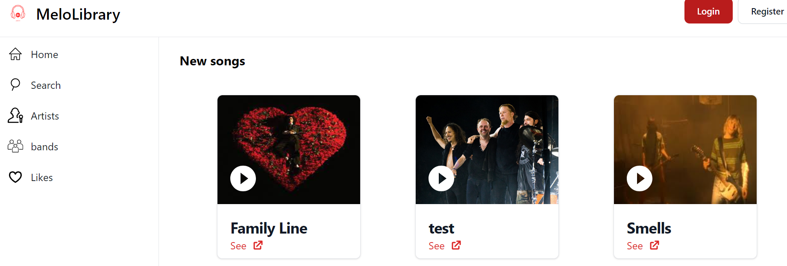

<h1>MeloLibrary</h1>

MeloLibrary is an online music library application that allows users to search and listen to music, add tracks to their playlists, and leave comments and ratings. Admin users have the ability to add, archive, and modify music tracks, as well as manage user comments.

<h2>Features</h2>
<ul>
  <li>User authentication system with two roles (client and admin)</li>
 <li>User can search and listen to music tracks</li>
 <li>User can add tracks to their playlists</li>
 <li>User can leave comments and ratings on tracks</li>
 <li>User can share tracks on social media</li>
 <li>User can search for tracks by title, artist, genre, and keywords</li>
 <li>Admin can add, archive, and modify music tracks</li>
 <li>Admin can manage user comments</li>
 </ul>
<h2>Entities</h2>
<ul>
<li>A music track is defined by its cover image, title, artist(s) or group(s), writer(s), language(s), release date, lyrics, and duration.</li>
<li>An artist is defined by their image, name, country, and date of birth.</li>
<li>A band is defined by its name, image, members, country, and date of formation.</li>
</ul>
<h2>Technologies</h2>
<ul>
  <li>Laravel framework</li>
  <li>Blade templating engine</li>
  <li>Tailwind CSS framework</li>
</ul>

<a href="https://trello.com/invite/b/MJkQSKBd/ATTI89e41bbf80f47d597ae8e006ed2c5e1d715DD6A4/melolibrary">La planification est répartition des tâches sous Trello</a>
